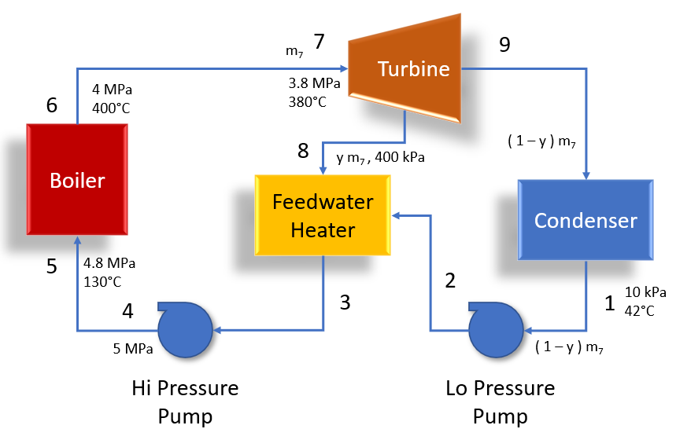

# Thermal Fluid Systems Project

The goal of this project is to analyze a real thermal fluids system with feedwater heater.  

Two scenarios will be studied:  

* High Pressure Pump performance drop-off versus Total Cycle Efficiency  
* Feedwater Heater fouling versus Total Cycle Efficiency  

Also, real world operation scenarios will be evaluated including start-up operations, steady state operations, and several different failure modes analyzed.  

